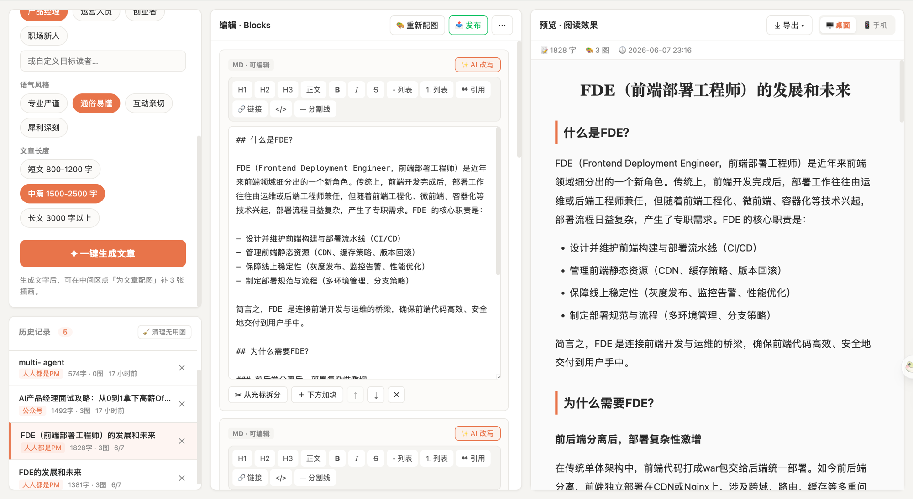
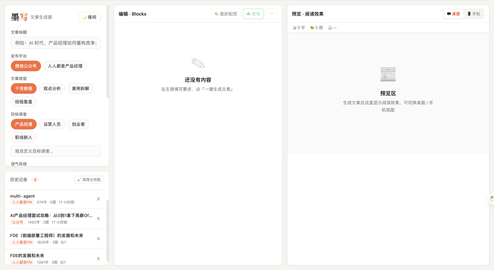

<div align="center">

# 🖋️ 墨写 Moxie · 面试版

**一个帮助 AI 产品经理把观察、资料和个人判断转化为可信内容的人机协作工作台**


为「微信公众号」和「人人都是产品经理」而生，但不再只是“一键代写” —— 它会先收集人的观点、真实经验和不确定问题，再让 AI 追问、成稿、分层检查事实/推论/观点，并生成可展示的人机协作过程报告。

<br/>



</div>

---

## ✨ 这是什么

墨写面试版是一个本地运行的单页应用。它的产品定位从“AI 文章生成器”升级为“可信内容工作流”：AI 不替你思考，而是帮助你把自己的判断变得更清晰、更有依据、更适合发表。

这版特别适合在 AI 产品经理面试中展示 5 个能力点：

1. **观点工作台**：生成前先写核心观点、真实观察和不确定问题。
2. **AI 追问**：让 AI 在写作前提出反例、证据和读者价值相关的问题。
3. **事实 / 推论 / 观点分层**：生成后标记哪些是事实、哪些是推论、哪些是人的观点。
4. **质量评估面板**：评估观点原创度、事实可信度、逻辑完整度、读者价值、平台适配度和 AI 味风险控制。
5. **创作过程报告**：记录人的输入、AI 的贡献、人工决策点和发布前检查项，方便面试展示。

你需要告诉它**你的观点是什么、为什么这么想、哪里还不确定、发到哪、给谁看、什么语气、多长**，它就会：

1. 用 AI 写出结构清晰的中文文章（边写边显示，像打字一样）；
2. 为文章自动生成 3 张统一风格的**手绘插画**（开头 / 中间 / 结尾）；
3. 提供"所见即所得"的编辑器和公众号风格预览；
4. 自动生成可信度评估、表达诊断和创作过程报告；
5. 一键复制富文本 / 导出长图 / 推送到公众号草稿箱。

适合需要持续产出公众号、行业号、个人博客的**内容创作者、产品 / 运营从业者**。

> 🔒 你的 API Key 只存在本地，不会上传，也不会进代码仓库。

---

## 🎯 核心功能

### 📝 智能写作
- **两大平台风格**：微信公众号（有钩子、短段、emoji）/ 人人都是产品经理（严谨、结构化）
- **可调维度**：文章类型（干货教程 / 观点分析 / 案例拆解 / 经验复盘）、目标读者、语气风格、篇幅长短
- **流式生成**：正文逐字浮现，能实时看到 AI 在写什么；写到一半可随时**中断**

### 🎨 自动配图
- 一键为全文生成 3 张**手绘漫画风插画**，自动放到开头 / 中段 / 结尾
- 出图进度可视（第 N/3 张），支持**单张重新生成**、下载单张 / 全部
- 图片缺失时优雅提示，可一键补图

### ✍️ 像 Word 一样编辑（不用懂 Markdown）
- 选中文字点按钮即可设**标题 / 加粗 / 斜体 / 列表 / 引用 / 链接 / 分割线**
- 文字块可**拆分、新增、上移下移、删除**
- **AI 改写**：对任意一段一键「更口语 / 更精炼 / 扩写 / 润色」
- **表达诊断改写**：识别空泛套话、模板化表达和缺少证据的强判断，再改得更具体

### 👀 真实预览
- 公众号风格排版，**桌面 / 手机**一键切换，手机端按移动阅读优化
- 实时显示字数、图数、创作时间
- ☀️ / 🌙 **亮暗模式**，护眼夜读

### 📤 导出 & 发布
- **复制富文本**：直接粘贴进公众号编辑器 / Word，格式和图片都在
- **导出长图 PNG**：适合发朋友圈 / 小红书
- **导出 Markdown 文件**
- **一键发布到微信公众号草稿箱**（可选，见下）

### 🗂️ 历史记录
- 每次生成自动保存，可随时**恢复、删除**
- 一键清理服务器上不再使用的配图，回收空间

---

## 🚀 快速开始

### 1. 准备
- 安装 [Node.js](https://nodejs.org/) 18 及以上
- 一个 [DeepSeek API Key](https://platform.deepseek.com/)（用于写文，**必需**）
- （可选）配图需要 Apimart 的 key；发布公众号需要公众号凭据，见后文

### 2. 安装
```bash
git clone https://github.com/lykAntonio/moxie.git
cd moxie
npm install
sh scripts/install-hooks.sh   # 安装防密钥泄露钩子（推荐）
```

### 3. 启动
```bash
npm run dev
```
打开终端提示的地址（默认 http://localhost:5273 ）。

### 4. 填入你自己的 Key
打开页面后，点**右上角 ⚙️ 设置**，填入：
- **DeepSeek API Key**（写文章用，必填）— [去获取](https://platform.deepseek.com/)
- **Apimart API Key**（自动配图用，选填）— [去获取](https://apimart.ai/)

> 🔐 Key 只保存在**你这台浏览器本地**，仅用于直接调用对应服务。**用谁的 key 就计谁的费用**，不会上传、不会共享给别人。

（也可以不在界面填，改在 `.env` 里配 `DEEPSEEK_API_KEY` / `APIMART_API_KEY`，适合自己一个人用。）

---

## 📖 怎么用



1. **左侧**填标题、核心观点、真实经验、不确定问题，再选平台 / 类型 / 读者 / 语气 / 长度 → 点 **「✦ 生成可信文章」**
2. 满意后点 **「🎨 配图」** 生成插画（约 1 分钟）
3. **中间**编辑区：用工具栏排版、用「✨ AI 改写」润色、拖动调整图片位置
4. **右侧**预览成稿，切换桌面 / 手机查看效果
5. 用 **「⤓ 导出」** 复制富文本 / 导出长图，或点 **「📤 发布」** 推送到公众号草稿箱

---

## 🔑 关于各项 Key（按需配置）

| 能力 | 需要的 Key | 是否必需 | 在哪填 |
|------|-----------|---------|--------|
| 写文章 | DeepSeek API Key | ✅ 必需 | 页面 ⚙️ 设置（或 `.env`） |
| 自动配图 | Apimart Key | 想配图才需要 | 页面 ⚙️ 设置（或 `.env`） |
| 发布公众号 | 公众号 AppID/Secret | 想直接发才需要 | 配套发布 skill 的 `.env` |

- **谁用谁的 Key、谁付费**：在 ⚙️ 设置里填的 Key 只存在你本地浏览器，随请求直接调用对应服务，不会用到别人的额度。
- 后端优先用请求里带的 Key，没有时才回退到 `.env`。
- 模型默认 `deepseek-chat`，可在 `.env` 改 `DEEPSEEK_MODEL`。

> 💡 **想把它部署给多人在线用？** 别在服务器 `.env` 里放你自己的 Key，让每个人在 ⚙️ 设置里填各自的 Key 即可——这样不会替别人买单。

---

## 📤 发布到公众号（可选）

墨写可调用配套的「公众号自动发布」工具，把成稿连图一起推送到**草稿箱**（不会自动群发，可随时在后台删除）。

使用前注意微信的限制：
- 调用接口的机器**出口 IP 需加入公众号后台的「IP 白名单」**（设置与开发 → 基本配置）。
- 部分账号白名单**只有一个 IP 生效**，换网络（家 ↔ 公司）或家用 IP 变动后需要更新。
- 墨写内置「🌐 查看公众号出口 IP」助手（编辑区「⋯ 更多」里），发布失败会自动提示当前被拒的 IP，方便复制添加。

---

## ❓ 常见问题

**配图失败 / 很慢？** 出图是异步的，单张约几十秒；请确认 Apimart key 有余额。

**发布提示 IP 不在白名单（40164）？** 把墨写弹窗里显示的 IP 加进公众号 IP 白名单；若仍失败，多为白名单刚改、未生效或未完成管理员扫码确认。

**图片显示"缺失"？** 对应的本地配图被清理了，点该图的「⟳ 重新生成」即可。

**历史记录会丢吗？** 保存在浏览器本地（localStorage），换浏览器 / 清缓存会清空；图片存在本机。

---

## 🛠️ 技术栈

前端 Vite + React + TypeScript（react-markdown 渲染）；本地轻量 Node 后端代理 DeepSeek 与出图脚本；历史记录用浏览器 localStorage。
> 为什么要本地后端：API Key 不能暴露在浏览器，且出图需要调用本地脚本。

---

<div align="center">
用 ❤️ 写作，让好内容更快被看见。
</div>
