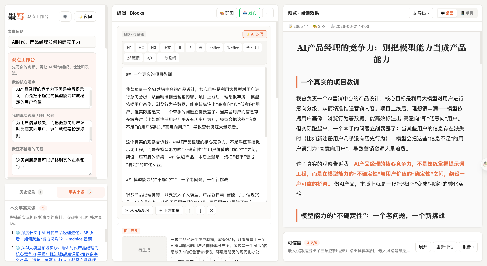
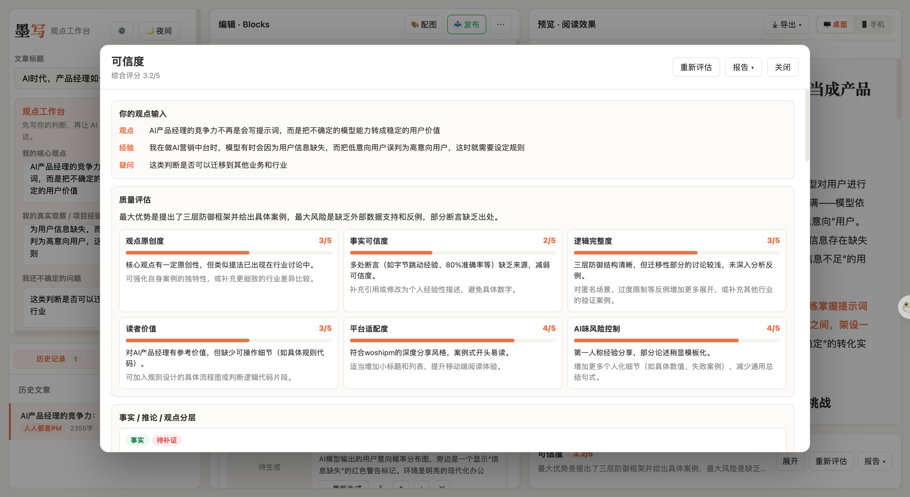

<div align="center">

# 墨写 Moxie

**面向 AI 产品经理与内容创作者的可信内容工作台**


墨写把「观点输入、资料核验、AI 成稿、可信度诊断、平台化发布」放进同一条工作流。它关注的不是让 AI 替人写得更快，而是让人的判断、经验和证据在 AI 协作中被保留下来、被检验，并最终转化成可发布的高质量内容。

<br/>



</div>

---

## 项目定位

墨写是一个本地运行的 AI 内容工作台，适合需要持续输出专业文章的产品、运营、研究和内容创作者。它不是传统的「输入一句 prompt -> 等 AI 生成全文」工具，而是把内容生产拆成一套更可控的产品流程：

1. 先明确用户自己的核心观点、真实经验和不确定问题；
2. 再让 AI 追问反例、证据、读者价值和表达角度；
3. 生成文章时接入参考资料和联网检索，降低事实幻觉；
4. 成稿后进行可信度评估，区分事实、推论和观点；
5. 最后以富文本、HTML、长图或公众号草稿的方式交付。

这个项目的核心命题是：**AI 内容产品的价值不应停留在“生成”，而要帮助用户把不确定的模型输出转化为更稳定、更可信、更可解释的表达。**

---

## 我解决的问题

很多 AI 写作工具能快速生成一篇看起来完整的文章，但在真实内容生产里，最容易出问题的往往不是「写不出来」，而是：

- 文章很顺，但看不见作者自己的判断；
- 观点有道理，但缺少具体经验或场景支撑；
- 模型把推测写成事实，读者很难判断可信度；
- 生成结果难以继续编辑、复盘和发布；
- 内容平台需要不同表达风格，普通 AI 输出经常不够适配。

因此，墨写把产品目标定义为三层：

| 层级 | 产品目标 | 对应设计 |
|------|----------|----------|
| 思考层 | 先让人把判断说清楚 | 观点工作台、AI 追问、不确定问题 |
| 可信层 | 把事实、推论和观点显性化 | 事实来源、可信度评分、分层诊断 |
| 交付层 | 让内容进入真实发布流程 | 编辑器、预览、配图、导出、公众号草稿 |

---

## 核心亮点

### 1. 观点工作台：先有人，再有 AI

生成前必须填写「核心观点」「真实观察 / 项目经验」「仍不确定的问题」。这会迫使内容从用户的判断出发，而不是把 AI 当成答案机器。AI 的角色被设计为协作者：先追问，再组织，再补全表达。

### 2. AI 追问：把 prompt 从命令变成对话

墨写会在写作前生成一组追问，覆盖反例、读者价值、证据缺口和迁移边界。用户可以据此补充回答，让文章在进入生成阶段前就完成一次产品式澄清。

### 3. 事实来源：降低模型幻觉

支持手动粘贴资料、输入参考链接，也可以配置 Tavily 做联网检索。生成文章时，这些资料会作为强约束进入提示词；生成后，来源会在左侧「事实来源」标签页中展示，方便逐条核对。

### 4. 可信度面板：把质量风险产品化

右侧预览区默认只显示一个小型可信度条，避免打断阅读；点击展开后进入居中大弹窗，展示完整的质量评估、事实 / 推论 / 观点分层、表达诊断和创作过程报告。



### 5. 多格式交付：从草稿到发布

支持复制富文本、导出 HTML、导出 Markdown、导出长图，也可选配微信公众号草稿箱发布。Markdown 作为稳定的纯文本兜底，HTML 和富文本用于保留更完整的视觉结构。

### 6. AI 辅助产品构建实践

这个项目也体现了一种新的产品构建方式：用自然语言快速定义需求、生成代码原型，再通过实际体验不断收敛交互、信息架构和功能边界。AI 提供实现速度，产品判断决定哪些能力应该留下、如何组合、何时约束。

---

## 功能清单

### 内容生成

- 支持微信公众号、人人都是产品经理两种平台表达风格；
- 支持干货教程、观点分析、案例拆解、经验复盘等文章类型；
- 可配置目标读者、语气风格和篇幅长度；
- DeepSeek 流式生成，正文逐段出现，生成中可中断；
- 生成前可开启参考资料、链接抓取和联网检索。

### 编辑与预览

- Markdown 可视化编辑，支持标题、加粗、斜体、列表、引用、链接、分割线；
- 支持文字块拆分、新增、上移、下移、删除；
- 支持对任意段落做 AI 改写；
- 右侧提供公众号风格实时预览，可切换桌面 / 手机视图；
- 显示字数、图片数和创作时间。

### 配图与排版

- 一键为文章生成开头、中段、结尾 3 张统一风格插画；
- 支持单张重新生成、下载单张或下载全部；
- 图片缺失时给出明确提示，并可重新补图；
- 支持亮色 / 暗色模式。

### 可信度与报告

- 综合评分：观点原创度、事实可信度、逻辑完整度、读者价值、平台适配度、AI 味风险控制；
- 事实 / 推论 / 观点分层，提示哪些句子需要补充来源；
- 表达诊断，识别空泛套话、过强判断和缺少证据的表达；
- 创作过程报告记录人的输入、AI 的贡献、人工决策点和发布前检查项；
- 报告支持复制富文本、导出 HTML，并保留 Markdown 纯文本兜底。

### 历史与来源

- 每次生成自动保存历史记录，可随时恢复或删除；
- 历史记录与事实来源合并为左侧底部标签页；
- 默认展示历史记录，避免来源列表遮挡历史文章；
- 可清理服务器上不再使用的配图，回收本地空间。

---

## 快速开始

### 1. 准备环境

- 安装 [Node.js](https://nodejs.org/) 18 及以上；
- 准备 [DeepSeek API Key](https://platform.deepseek.com/)；
- 如需自动配图，准备 Apimart API Key；
- 如需联网检索，准备 [Tavily API Key](https://tavily.com/)。

### 2. 安装项目

```bash
git clone https://github.com/lykAntonio/moxie-aipm-workbench.git
cd moxie-aipm-workbench
npm install
sh scripts/install-hooks.sh
```

### 3. 启动本地工作台

```bash
npm run dev
```

打开终端提示的地址，默认是：

```text
http://localhost:5273
```

### 4. 配置 API Key

进入页面后点击右上角设置，按需填写：

| 能力 | Key | 是否必需 | 用途 |
|------|-----|----------|------|
| 文章生成 / 追问 / 可信度评估 | DeepSeek API Key | 必需 | 调用大模型生成和分析内容 |
| 自动配图 | Apimart API Key | 可选 | 生成文章插画 |
| 联网检索 | Tavily API Key | 可选 | 检索可核对的事实来源 |

Key 默认保存在浏览器本地。也可以复制 `.env.example` 为 `.env`，在本地环境变量中配置：

```bash
cp .env.example .env
```

---

## 怎么使用

1. 在左侧填写文章标题、核心观点、真实观察 / 项目经验和仍不确定的问题；
2. 点击「生成 3 个追问」，先让 AI 帮你暴露证据缺口和表达盲区；
3. 按需填写参考资料、参考链接或开启联网检索；
4. 选择平台、类型、读者、语气和篇幅，生成可信文章；
5. 在中间编辑区继续改结构、调段落、做 AI 改写或补充配图；
6. 在右侧预览区检查桌面和手机阅读效果；
7. 展开可信度面板，查看质量评估、事实分层和表达诊断；
8. 最后复制富文本、导出 HTML / Markdown / 长图，或发布到公众号草稿箱。

---

## 公众号发布说明

墨写可以调用配套发布能力，把成稿和配图推送到微信公众号草稿箱。它不会自动群发，仍需要你进入公众号后台做最终检查。

使用前请注意：

- 需要配置公众号 AppID 和 AppSecret；
- 调用接口的机器出口 IP 需要加入公众号后台「IP 白名单」；
- 家庭网络、公司网络、代理网络切换后，出口 IP 可能变化；
- 发布失败时，系统会提示当前被拒的 IP，方便复制到白名单中。

---

## 技术实现

| 模块 | 技术选择 |
|------|----------|
| 前端 | Vite + React + TypeScript |
| 内容渲染 | react-markdown + remark-gfm |
| 本地服务 | Node.js HTTP server |
| 大模型 | DeepSeek Chat Completions |
| 联网检索 | Tavily Search API |
| 配图 | Apimart 出图接口 + 本地脚本编排 |
| 历史记录 | localStorage |
| 导出 | 富文本剪贴板、HTML 文件、Markdown、html2canvas 长图 |

本地后端主要承担三件事：代理模型请求、处理事实资料和检索、托管本地生成的图片。这样可以避免把敏感 Key 写进前端代码，也让图片和发布流程更接近真实内容生产环境。

---

## 安全与边界

- API Key 不提交到仓库，`.gitignore` 已忽略 `.env` 等本地配置；
- 项目提供安装钩子，降低误提交密钥的风险；
- 可信度评分不是事实裁判，而是发布前的质量检查清单；
- 联网检索和参考资料能降低幻觉，但仍需要用户核对关键事实；
- 生成内容适合做初稿和结构化表达，最终判断仍由使用者负责。

---

## 常见问题

**没有 Apimart Key 能用吗？**

可以。写作、编辑、预览、可信度评估都可以正常使用，只是不能自动生成插画。

**联网检索一定要开吗？**

不一定。写个人经验、方法论复盘时可以只用手动资料；写新闻、产品动态、数据类内容时建议配置 Tavily 并核对来源。

**历史记录会保存在哪里？**

文章历史保存在当前浏览器的 localStorage 中。换浏览器或清理缓存后会丢失；生成图片保存在本机项目目录下。

**为什么报告还保留 Markdown？**

Markdown 是稳定的结构化纯文本，适合 README、技术文档和聊天窗口；富文本和 HTML 更适合保留视觉排版。墨写同时提供三种方式，是为了覆盖不同交付场景。

---

<div align="center">

让 AI 帮人表达，而不是替人思考。

</div>
